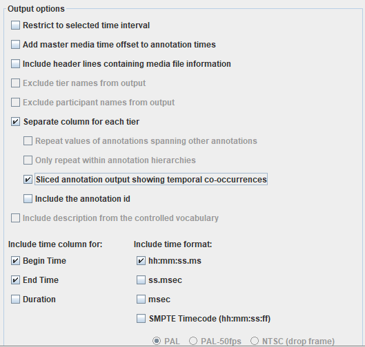

# anotation2frame

This repository provides programs which links human annotations to each frame of videos.

### Requirements

Please install ffprobe and python.
Pandas, numpy and ffmpeg packages are required.

### Tutorial Video (Jump to YouTube)
[](https://youtu.be/Qv5YiqqgN2U?si=0Y-xy_Qn-_8j04Q4)

### Step0 - Annotation

In this script, ELAN usage is assumed.
Please output ELAN annotation as shown in the figure below.


Finally output text format should be like below.
If you use other annotation tools, please adjust to this format.
| Begin Time - hh:mm:ss.ms | End Time - hh:mm:ss.ms | annotation_1 | ... | annotation_N |
|--------------------------|------------------------|-------|-----------|-----------|
| | | | | |

### Step1 - Get data of each frame

Run ffprobe and you will get the data of pts/pts_time/pkt_duration_time.
Make a directory under "InputData/", and put videos under the directory.
Finally run "ffprobe.py".

```
python ffprobe.py -d DIRECTORY_NAME
```

If you just want to try running the script, please replace DIRECTORY_NAME to "Sample"

### Step2 - Link ffprobe data to annotation

Please set the name of the anotation file the same as the name of the video file.
Here, the results of ffprobe and annotation are merged.
Annotation is assumed to be produced using ELAN.
If you are using another annotation tool, you may need to modify the script.
Make a directory under "OutputData/ELAN" and name the same as video directory.
And put annotations under the directory corresponding to videos.
Finally run annotation.py like below.

```
python annotation.py -d DIRECTORY_NAME
```

We process each row in ELAN annotation in for loops.
In each raw, find the frame index of which “pts_time” is closest to “Begin Time” (begin_ind)
Similarly, find the frame index of which “pts_time” is closest to “End Time”(end_ind)
Fill frames between begin_ind and end_ind with the annotation of the row.

## Reference
We used the following video as Sample video data.
OSF: https://osf.io/2n3j7  
VIDEO: study-57bc591dc0d9d70055f775db_child-111e4f19_video-c6f3fd28_privacy-public_video.mp4  

This video is from the gaze estimation research conducted by Erel et al. (2022).  
Erel, Y., Shannon, K. A., Chu, J., Scott, K., Kline Struhl, M., Cao, P., Tan, X., Hart, P., Raz, G., Piccolo, S., Mei, C., Potter, C., Jaffe-Dax, S., Lew-Williams, C., Tenenbaum, J., Fairchild, K., Bermano, A., & Liu, S. (2023). iCatcher+: Robust and automated annotation of infants’ and young children’s gaze behavior from videos collected in laboratory, field, and online studies. *Advances in Methods and Practices in Psychological Science*, *6*(2), 251524592211472. https://doi.org/10.1177/25152459221147250
